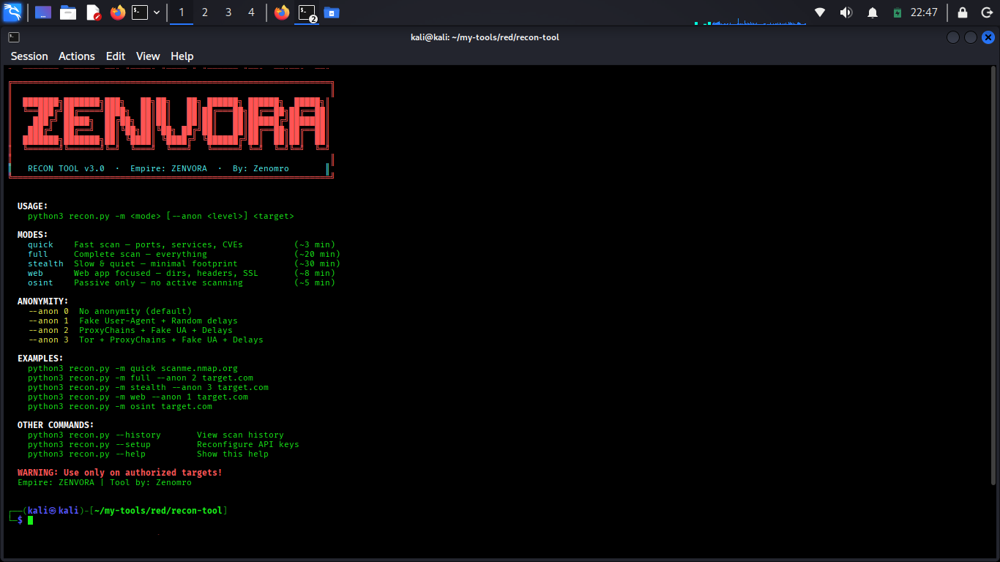
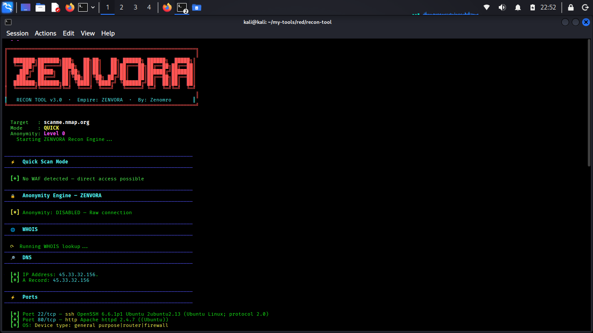
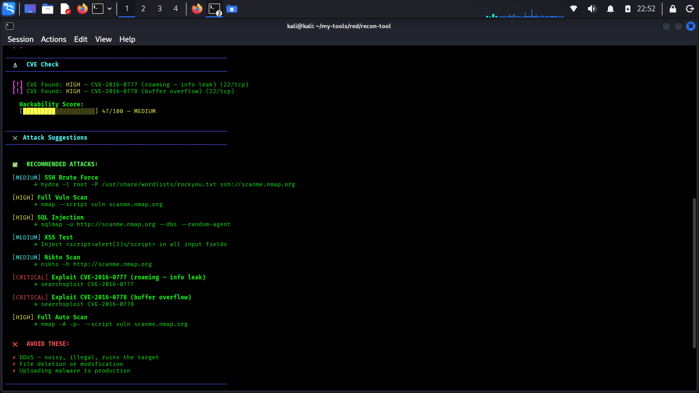
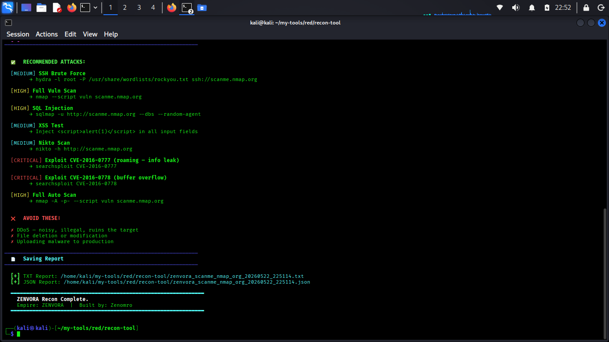

````md
<div align="center">

# ZENVORA Recon Framework

```text
███████╗███████╗███╗   ██╗██╗   ██╗ ██████╗ ██████╗  █████╗
╚══███╔╝██╔════╝████╗  ██║██║   ██║██╔═══██╗██╔══██╗██╔══██╗
  ███╔╝ █████╗  ██╔██╗ ██║██║   ██║██║   ██║██████╔╝███████║
 ███╔╝  ██╔══╝  ██║╚██╗██║╚██╗ ██╔╝██║   ██║██╔══██╗██╔══██╗
███████╗███████╗██║ ╚████║ ╚████╔╝ ╚██████╔╝██║  ██║██║  ██║
╚══════╝╚══════╝╚═╝  ╚═══╝  ╚═══╝   ╚═════╝ ╚═╝  ╚═╝╚═╝  ╚═╝
````

### Advanced Reconnaissance Framework for Authorized Security Testing

[](https://python.org)
[](https://kali.org)
[](LICENSE)
[]()
[]()

Built and maintained by **Zenomr0**

</div>

---

# Disclaimer

> ⚠️ This project is intended strictly for:
>
> * Authorized penetration testing
> * Security research
> * CTF environments
> * Educational purposes
>
> Unauthorized scanning or testing of systems without explicit permission may violate local and international laws.
>
> The author assumes no liability for misuse or damage caused by this software.

---

# Table of Contents

* Features
* Scan Modes
* Anonymity Engine
* Screenshots
* Installation
* Usage
* Report Output
* CVE Detection
* Project Structure
* Safety Policy
* Roadmap
* Connect With Me
* License

---

# Features

| Category          | Capability                                                      |
| ----------------- | --------------------------------------------------------------- |
| Scanning          | Port scanning, service fingerprinting, OS detection             |
| OSINT             | WHOIS, DNS enumeration, subdomain discovery                     |
| Web               | Directory enumeration, SSL inspection, security header analysis |
| Intelligence      | CVE correlation, Shodan integration                             |
| Defense Awareness | WAF fingerprinting and detection                                |
| Privacy           | ProxyChains, Tor integration, random delays, fake User-Agents   |
| Reporting         | TXT + JSON report generation                                    |
| History           | SQLite scan history tracking                                    |
| Scoring           | Automated target risk scoring                                   |

---

# Scan Modes

```text
┌─────────────┬──────────────────────────────────────────────┬──────────┐
│ Mode        │ Description                                  │ ETA      │
├─────────────┼──────────────────────────────────────────────┼──────────┤
│ quick       │ Fast recon — ports, services, CVEs           │ ~3 min   │
│ full        │ Full reconnaissance workflow                 │ ~20 min  │
│ stealth     │ Low-noise scan mode                          │ ~30 min  │
│ web         │ Web application focused assessment           │ ~8 min   │
│ osint       │ Passive intelligence gathering only          │ ~5 min   │
└─────────────┴──────────────────────────────────────────────┴──────────┘
```

---

# Anonymity Engine

```text
Level 0 — Raw connection
Level 1 — Fake User-Agent + Random Delays
Level 2 — ProxyChains + User-Agent masking
Level 3 — Tor + ProxyChains integration
```

> Tor sessions are automatically started and stopped during Level 3 scans.

---

# Screenshots

## Main Interface



---

## Quick Scan



---

## CVE Detection



---

## Report Generation



---

# Installation

## Clone Repository

```bash
git clone https://github.com/zenomr0/zenvora-recon.git
cd zenvora-recon
```

---

## Automated Setup

```bash
sudo python3 setup.py
```

---

## Manual Dependency Installation

```bash
sudo apt update

sudo apt install -y \
nmap gobuster wafw00f dnsenum theharvester \
proxychains4 tor hydra sqlmap nikto \
masscan whatweb dnsutils curl openssl
```

---

# Requirements

* Kali Linux / Debian-based Linux
* Python 3.8+
* Root privileges recommended

---

# Usage

```bash
python3 recon.py -m <mode> [--anon <level>] <target>
```

---

# Examples

```bash
# Quick reconnaissance
python3 recon.py -m quick scanme.nmap.org

# Full reconnaissance with ProxyChains
python3 recon.py -m full --anon 2 target.com

# Stealth mode with Tor
python3 recon.py -m stealth --anon 3 target.com

# Web application assessment
python3 recon.py -m web --anon 1 target.com

# Passive OSINT mode
python3 recon.py -m osint target.com

# View previous scans
python3 recon.py --history

# Configure API keys
python3 recon.py --setup
```

---

# Example Output

```text
[+] Target: scanme.nmap.org
[+] Open Ports: 22, 80

[+] Detected Services:
    - OpenSSH 6.6.1
    - Apache httpd 2.4.7

[!] CVE Match:
    - CVE-2021-41773

[+] Risk Score: 47/100
```

---

# Report Output

Each scan automatically generates:

```text
zenvora_target_20260522_213037.txt
zenvora_target_20260522_213037.json
```

---

# Report Sections

```text
[1] WHOIS Information
[2] DNS Records
[3] Subdomain Enumeration
[4] Email Discovery
[5] Open Ports & Services
[6] CVE Correlation
[7] WAF Detection
[8] Directory Enumeration
[9] Security Header Analysis
[10] Risk Scoring
[11] Recommendations
```

---

# CVE Detection

ZENVORA performs basic service-version correlation against known CVEs.

| Service       | Vulnerability  |
| ------------- | -------------- |
| Apache 2.4.49 | CVE-2021-41773 |
| OpenSSL 1.0.1 | CVE-2014-0160  |
| vsftpd 2.3.4  | CVE-2011-2523  |
| Drupal 7      | CVE-2018-7600  |
| SMBv1         | MS17-010       |

---

# Safety Policy

ZENVORA is designed for reconnaissance and defensive security research only.

The framework does NOT perform:

* Autonomous exploitation
* Persistence deployment
* Malware installation
* Destructive actions

All operations remain manually controlled by the operator.

---

# Project Structure

```text
zenvora-recon/
│
├── assets/
│   ├── main-interface.png
│   ├── quickscan.png
│   ├── cve-check.png
│   └── reportgene.png
│
├── recon.py
├── setup.py
├── requirements.txt
├── README.md
├── LICENSE
└── .gitignore
```

---

# Roadmap

* [x] Port scanning
* [x] CVE matching
* [x] WAF detection
* [x] Report generation
* [ ] Plugin support
* [ ] Web dashboard
* [ ] Multi-target scanning
* [ ] Docker deployment
* [ ] AI-assisted reporting

---

# Connect With Me

<div align="center">

<a href="https://github.com/zenomr0">

</a>

<a href="https://instagram.com/ze.nomro">

</a>

<a href="https://t.me/Zenomro">

</a>

</div>

---

# License

MIT License © 2026 Zenomr0

---

<div align="center">

### ZENVORA Recon Framework

Built for security researchers and authorized assessments.

</div>
```
